# SAIMOR OS / OpenFlow / Dashboard Product Architecture - Design Spec
**Date:** 2026-06-01
**Status:** Draft for user review
**Scope:** INTERFACE-first product architecture with CORE contracts identified

---

## Product Decision

SAIMOR is not choosing between OS, Finder, Universe, OpenClaw, Larry, or Dashboard.

The target architecture is:

1. **SAIMOR OS** stays the immersive desktop work environment.
2. **OpenFlow Core** becomes the shared runtime layer for signals, agents, workflows, and memory.
3. **OpenClaw/Larry Dashboard** remains a standalone product for agent operations, monitoring, and flow control.

The products share runtime concepts, not UI.

The OS answers: **What changed, what matters, and what should I do next?**

The Dashboard answers: **What agents, flows, connectors, incidents, and handoffs are running?**

---

## Non-Negotiables

- Keep the OS feeling: desktop, dock, windows, Finder, files, MORA, Universe, ambient layers, mycelium, cosmic atmosphere.
- Do not flatten SAIMOR into a normal SaaS dashboard.
- Do not turn the Dashboard into only an OS pane. It must remain independently deployable and sellable.
- Do not make OpenClaw a visible competing personality in SAIMOR OS. OpenClaw is execution/orchestration.
- Keep personal-agent trust boundaries: the personal agent works first for the human, not for management.
- MORA receives summarized signals, not every raw private event.
- Keep internal Nodes/Relations. Evolve visible language toward initiatives, decisions, risks, changes, and context.

---

## Existing System Fit

### What Already Fits

`components/os/shell/MoraShell.tsx` already provides the correct shell model:
- immersive full-screen OS
- ambient background stack
- Dock
- pane/window system
- Universe controls
- MORA greeting and overlays
- drag/drop intake and mycelium summary

`components/home/HomeSurface.tsx` already points in the right direction:
- briefing-oriented home
- communication hooks
- activity surface
- recent work
- quick actions

`components/home/UniverseView.tsx` already supports the map metaphor:
- departments as spatial bodies
- semantic routes
- similarity/relationship visualization
- layer insight rails

`apps/finder/index.tsx` already supports the desktop/file-system promise:
- hierarchy navigation
- search
- file/document opening
- Universe navigation handoff
- routing and placement logic

`lib/apps/appRegistry.ts` already proves the OS can contain dedicated apps:
- Finder
- Mail
- Integrations
- Tasks
- Calendar
- Search
- Timeline
- Work Session
- Settings
- Terminal

`apps/mail/index.tsx` already has the right behavioral seed:
- fetches mail
- announces new messages
- lets the user send a mail to MORA
- can become a live signal source instead of a passive app

`apps/integrations/index.tsx` already has the right onboarding/integration seed:
- source overview
- desktop/setup lanes
- communication surface
- cloud/mail/calendar direction

The Larry/OpenClaw server already proves the other side:
- Dashboard has routes for chat, email, inbox, memory, nightwatch, missions, Google calendar, OneDrive, gateway, settings, system.
- Dashboard can talk to OpenClaw gateway.
- OpenClaw config already separates Larry and MORA identities conceptually.
- Nightwatch proves signals, containers, incidents, metrics, agent chat, and customer signals can be surfaced.

---

## What Feels Wrong Today

### OS Issues

The OS has the right atmosphere, but too much meaning is still implicit.

Current risk:
- Universe can feel like visual design instead of operational map.
- Finder can feel like storage instead of context.
- Home can feel like a dashboard if it gets too many panels.
- Nodes are technically useful but too low-level as a primary user concept.
- Integrations exist as setup surfaces, but not yet as sources that actively shape the OS.

### Dashboard Issues

The Dashboard is useful but too dark, dense, and NOC-like for the product direction.

Current risk:
- It looks like internal infrastructure tooling.
- It does not yet have a clean product boundary from OS.
- It shows runtime data, but not enough product-level hierarchy: agents, flows, sources, handoffs, outcomes.

### Architecture Risk

If OS and Dashboard evolve separately, the same concepts will be rebuilt twice:
- agent status
- flow state
- connector status
- signal priority
- handoff approval
- memory graph writeback

The fix is a shared contract layer, not a shared UI.

---

## Target Model

```mermaid
flowchart LR
    subgraph Sources["Connected Sources"]
        Mail["Mail"]
        Cloud["Cloud"]
        CRM["CRM"]
        ERP["ERP"]
        Server["Server"]
        Git["Git"]
        Calendar["Calendar"]
    end

    subgraph Core["Shared OpenFlow Core"]
        Events["Events"]
        Signals["Signal Bus"]
        Agent["Personal Agent"]
        Flows["OpenFlow Engine"]
        Memory["Memory Graph"]
        Presentation["Presentation API"]
    end

    subgraph OS["SAIMOR OS"]
        Desktop["Desktop / Dock / Panes"]
        Finder["Finder"]
        Universe["Universe Map"]
        Mora["MORA Briefing"]
        Initiatives["Initiatives"]
    end

    subgraph Dashboard["OpenClaw Dashboard"]
        Runtime["Agent Runtime"]
        FlowBuilder["Flow Builder"]
        Ops["Ops Monitor"]
        Handoffs["Handoffs"]
    end

    Sources --> Events --> Signals
    Signals --> Agent
    Agent --> Flows
    Flows --> Memory
    Memory --> Presentation
    Presentation --> OS
    Presentation --> Dashboard
```



---

## Core Domain Concepts

### Event

An event is a raw or lightly normalized change from a connected source.

Examples:
- new mail received
- cloud document changed
- CRM opportunity updated
- server alert raised
- calendar meeting scheduled
- file uploaded

Events are not the main user-facing concept.

### Signal

A signal is an event after relevance, context, trust boundary, and priority have been evaluated.

Example:
- "Customer asked about launch date. Related to Website Relaunch. Decision missing."

Signals are visible in OS and Dashboard, but differently.

### Initiative

An initiative is the primary visible work context for humans.

Examples:
- Website Relaunch
- KI-Einfuehrung
- Product Launch
- Customer Project

Initial implementation should make initiatives a **derived and materialized view** over existing Nodes/Relations/Events, not a full replacement of the data model.

Reason:
- It avoids a risky rewrite.
- It lets existing Finder, Universe, search, and document flows keep working.
- It gives us space to later promote initiatives into a true CORE entity if usage proves it.

### OpenFlow

OpenFlow is the workflow/action layer.

It handles:
- trigger rules
- agent tasks
- human approvals
- handoffs
- suggested next steps
- workflow status
- writeback into memory

In OS, OpenFlow appears as contextual windows, MORA suggestions, and action cards.

In Dashboard, OpenFlow appears as runtime, flow builder, queues, and monitoring.

### Memory Graph

Memory Graph is the existing Nodes/Relations system plus enriched derived structures:
- initiatives
- decisions
- risks
- people
- departments
- source events
- signal links
- ownership
- unresolved questions

Internal data can stay technical. User copy should describe context, changes, decisions, and responsibility.

---

## Product Surfaces

### SAIMOR OS

The OS remains a desktop-like, spatial work environment.

Core surfaces:
- **Home / Lagebild:** "Was hat sich veraendert?", "Was braucht Aufmerksamkeit?", "Was ist der naechste sinnvolle Schritt?"
- **Finder:** still files/folders/windows, but with initiative-aware context and live source lanes.
- **Universe:** the map, not the navigation. It shows people, departments, initiatives, decisions, risks, and changes.
- **MORA:** orientation layer. MORA explains, prioritizes, asks for approval, and opens the right pane.
- **OpenFlow Pane:** a window inside OS for a specific flow, not the whole Dashboard.
- **Mail/Cloud/CRM/Server Apps:** still openable as apps, but also feed signals into the OS.

The OS should feel alive without becoming noisy.

### OpenClaw/Larry Dashboard

Dashboard remains standalone.

Core surfaces:
- **Runtime Monitor:** agents, models, queues, tool calls, health, incidents.
- **Flow Builder:** define triggers, steps, approvals, writebacks.
- **Signal Console:** inspect source events and promoted signals.
- **Handoff Queue:** what needs human approval.
- **Connector Health:** mail, cloud, CRM, ERP, server, calendar, Git.
- **Customer/Ops View:** productized version of Nightwatch, lighter and clearer.

Dashboard UI should be brighter and less infra-dark:
- more neutral glass/light surfaces
- less black/violet density
- clearer hierarchy
- dense, but not claustrophobic

### Shared Presentation API

The Presentation API maps shared runtime data into different UI shapes.

Same underlying object:

```ts
type Signal = {
  id: string;
  source: 'mail' | 'cloud' | 'crm' | 'erp' | 'server' | 'git' | 'calendar' | 'manual';
  title: string;
  summary: string;
  priority: 'low' | 'normal' | 'high' | 'urgent';
  status: 'new' | 'seen' | 'triaged' | 'linked' | 'resolved' | 'dismissed';
  relatedInitiativeId?: string;
  relatedNodeIds: string[];
  relatedRelationIds: string[];
  trustScope: 'personal' | 'department' | 'organization';
  suggestedActions: Array<{
    id: string;
    label: string;
    kind: 'reply' | 'create_decision' | 'open_flow' | 'assign_task' | 'archive' | 'ask_user';
  }>;
};
```

OS rendering:
- "Customer asked about launch date. Add decision?"

Dashboard rendering:
- source, priority, flow, current step, approval status, runtime metadata.

---

## New Account Journey

The first-run flow should evolve from organization setup into "MORA learns how you work."

Sequence:

1. **Identity and role**
   - What do you do?
   - What are you responsible for?
   - Do you work alone, in a team, or in an organization?

2. **Work style**
   - communication-heavy
   - project-heavy
   - sales/customer-heavy
   - operations/technical
   - mixed

3. **Connect sources**
   - Gmail/IMAP
   - Cloud/Drive/OneDrive
   - Calendar
   - CRM
   - ERP
   - Server/Git

4. **Trust boundaries**
   - what personal agent may read
   - what may be summarized to MORA
   - what may be shared with team/org

5. **Initial map build**
   - create first initiatives from user answers and connected signals
   - show "MORA is building your map"
   - open OS with first Lagebild, not an empty dashboard

---

## Implementation Strategy

### Phase 1 - Spec and Contracts

Define the shared contracts without changing large UI areas yet.

Deliverables:
- `Signal` contract
- `InitiativeSummary` contract
- `OpenFlowRun` contract
- `ConnectorStatus` contract
- OS vs Dashboard rendering rules
- trust scope rules

No heavy UI rewrite in this phase.

### Phase 2 - OS Lagebild

Evolve `HomeSurface` into the first real OS landing experience.

Work:
- keep ambient/cosmic background from `MoraShell`
- replace generic dashboard feel with three questions:
  - What changed?
  - What needs attention?
  - What is the next useful step?
- include signals from Mail/Cloud/CRM mock or existing hooks
- keep existing quick actions and recent work, but make them contextual
- add first initiative grouping as derived UI

### Phase 3 - Finder and Initiatives

Keep Finder, but make it context-aware.

Work:
- add initiative-aware lane or filter
- show related signals for current folder/node when available
- keep file/folder hierarchy intact
- expose "open in Universe" and "add to initiative" flows
- do not replace folders with initiatives

### Phase 4 - OpenFlow Pane in OS

Add a dedicated OS pane for a flow run.

Work:
- open from MORA, Mail, Finder, or Home
- show flow steps
- show human approval point
- show related memory context
- allow approve/dismiss/open dashboard

This is not the full Dashboard.

### Phase 5 - Dashboard Upgrade

Upgrade Larry/OpenClaw Dashboard separately.

Work:
- lighten visual system
- organize around Runtime, Flow Builder, Signals, Handoffs, Connectors
- preserve standalone routes/deployability
- expose links/deep links back into SAIMOR OS where useful

### Phase 6 - Real Connector Loop

Move from local/mock surfaces to real source loops.

Work:
- Mail event -> signal -> OS Lagebild
- Cloud event -> relation suggestion
- Server event -> dashboard incident + optional OS signal
- CRM event -> initiative/risk signal
- human approval -> memory writeback

---

## Data Flow

### Mail Example

1. Mail connector receives or fetches message.
2. Event is normalized: sender, subject, timestamp, body summary, attachments, account scope.
3. Personal Agent evaluates relevance privately.
4. Agent emits Signal with trust scope and suggested action.
5. Signal Bus links it to existing initiative or suggests a new one.
6. OS Home shows it under "What changed?"
7. MORA proposes action: reply, create decision, attach to initiative, dismiss.
8. If approved, OpenFlow writes result into Memory Graph.
9. Dashboard shows the full flow run and runtime trace.

### Server Incident Example

1. Server monitor emits event.
2. Dashboard shows runtime/incident immediately.
3. Signal is promoted to OS only if it affects user's work or an initiative.
4. MORA summarizes impact instead of showing raw infra metrics.

---

## Error Handling

### Connector Failure

OS:
- show "source currently unavailable" only when relevant to the user task
- avoid noisy global error banners
- keep last known signal state visible with timestamp

Dashboard:
- show connector health, error count, retry state, last success
- expose diagnostics and logs

### Agent/Flow Failure

OS:
- show a calm fallback: "MORA could not complete this step. Open details or retry."
- preserve the user's current window/context

Dashboard:
- show failed step, tool call, model/provider, retry policy, owner

### Privacy Boundary Conflict

If a signal would cross trust boundaries:
- OS asks the user before sharing
- Dashboard sees redacted or summarized state unless explicitly allowed
- Memory writeback records the approval decision

---

## Testing Strategy

### Unit Tests

Add tests for:
- signal normalization
- initiative derivation
- trust-scope filtering
- OS presentation mapping
- Dashboard presentation mapping
- flow state transitions

### Component Tests

Add tests for:
- Home/Lagebild renders changed/attention/next-step groups
- Finder still opens files/folders normally
- Finder can show initiative context without breaking folder navigation
- OpenFlow pane renders pending approval and resolved states
- Mail signal can open MORA action flow

### Integration Tests

Add tests for:
- mail event -> signal -> HomeSurface
- signal -> initiative link
- approval -> memory writeback
- dashboard deep link -> OS pane

### Manual Visual Verification

Use browser verification after each UI phase:
- desktop viewport
- laptop viewport
- mobile fallback where applicable
- no overlapping text
- ambient layers still visible
- controls remain readable
- Dashboard is lighter than current Nightwatch

---

## Out of Scope for First Implementation Plan

- Replacing Nodes/Relations.
- Building a full ERP/CRM connector suite.
- Rebuilding the whole Dashboard in the INTERFACE repo.
- Making Universe the primary navigation.
- Adding organization-wide surveillance features.
- Sending raw personal mail content to MORA or Dashboard by default.

---

## First Implementation Recommendation

Start with **Phase 1 + Phase 2**:

1. Define shared frontend contracts in INTERFACE.
2. Build a derived signal/initiative presentation layer using existing hooks and mockable data.
3. Evolve `HomeSurface` into the new Lagebild.
4. Keep the existing OS shell, ambient layers, Finder, Dock, and panes intact.

Reason:
- It creates visible product progress quickly.
- It does not require a backend rewrite.
- It gives OpenFlow/Dashboard a clear integration contract.
- It makes the OS feel alive before we touch the harder standalone Dashboard upgrade.

Dashboard upgrade should be the next spec/plan after the OS Lagebild contract is proven.
